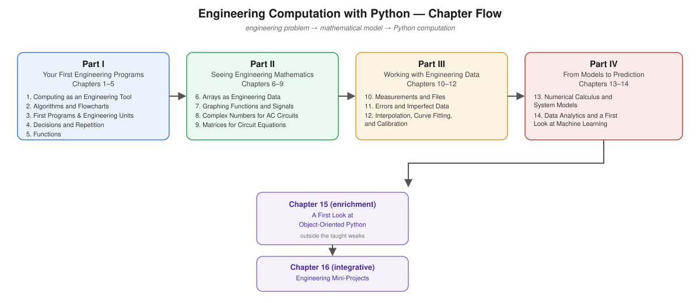

# Engineering Computation with Python

Beamer slide decks (16 chapters) for my book *Engineering Computation with Python: An Introduction for Electrical Engineering Students*.

## About the book

This book introduces Python as an engineering tool for students who may never have written a program before. Its purpose isn't to turn you into a software developer — it's to teach you how to take an engineering problem, express it mathematically, translate that mathematics into Python, run the calculation, visualize the result, and decide whether the result makes engineering sense.

The chapters follow a repeating pattern: **engineering problem → mathematical model → Python computation.** A variable becomes an array; an array becomes a signal; a signal can be plotted, analyzed, differentiated, and integrated; measurements can be fitted to a model, and that model used for prediction. Throughout, the same progression applies: **understand → calculate → visualize → experiment → interpret.**

Examples are drawn from electrical engineering — voltage, current, resistance, capacitance, frequency, sensor measurements, and system responses — so that mathematical ideas (complex numbers, matrices, derivatives, integrals, regression, statistics) are always introduced alongside the computation that makes them concrete.

## Chapter flow

The 16 chapters are grouped into four parts, one chapter per teaching week, followed by two non-week chapters.

- **Part I — Your First Engineering Programs** (Ch 1–5): computing as an engineering tool, algorithms and flowcharts, first programs, engineering units, decisions and repetition, and functions.
- **Part II — Seeing Engineering Mathematics** (Ch 6–9): arrays as engineering data, graphing functions and signals, complex numbers for AC circuits, and matrices for circuit equations.
- **Part III — Working with Engineering Data** (Ch 10–12): measurements and files, errors and imperfect data, and interpolation, curve fitting and calibration.
- **Part IV — From Models to Prediction** (Ch 13–14): numerical calculus and system models, then data analytics and a first look at machine learning.
- **Enrichment** (Ch 15–16, outside the taught weeks): a short introduction to object-oriented Python, and integrative mini-projects combining the whole book.

## Repository contents

- `Slides/ecp01.tex` – `ecp16.tex` — Beamer source for each chapter, plus compiled `.pdf` output
- `Slides/styles/` — shared Beamer theme (`flux`)
- `Slides/assets/` — logo asset used in the theme
- `images/` — chapter figures referenced by the slides
